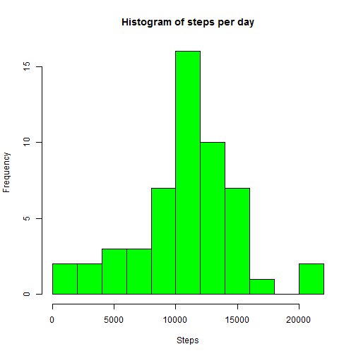
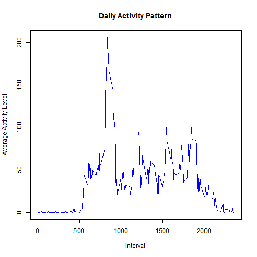
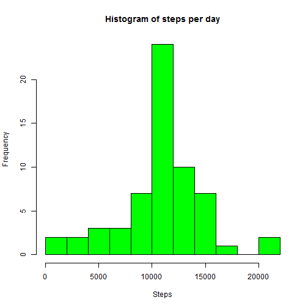
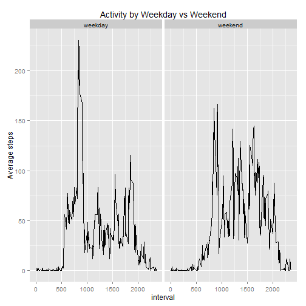

# Peer Assignment 1 for Coursera: Reproducible Research
## Submitted by Santoshkumar Murugan

=========================================================

# Loading and processing the data

Load the data into an object called **activitydate** and change the **date** column type from *Character* to *Date*


```r
activitydata <- read.csv("~/R Working Directory/5ReproducibleResearch1/activity.csv", stringsAsFactors=FALSE)
# Change the data type for date column in the dataset
activitydata = transform(activitydata,date=as.Date(date))
```

# Steps taken per day before imputing the NA's

Load in the **dplyr** package.


```r
library(dplyr)
```

Split the dataset into groups based on day and take the total steps per day and store in a data object called **summarydata**


```r
summarydata = activitydata %>% group_by(date) %>% summarise(steps_per_day=sum(steps,na.exclude = TRUE))
#plot the histogram and set the required properties
hist(summarydata$steps_per_day,xlab="Steps",col="green",main="Histogram of steps per day",breaks=10)
```

 

```r
#Plot the mean
mean(summarydata$steps_per_day,na.rm=TRUE)
```

```
## [1] 10767.19
```

```r
#Plot the median
median(summarydata$steps_per_day,na.rm=TRUE)
```

```
## [1] 10766
```

# Average Daily Activity Pattern
Summarise the data by interval and plot the average for each interval across days against the interval


```r
patterndata = activitydata %>% group_by(interval) %>% summarise(daily_activity_pattern=mean(steps,na.rm = TRUE))
# Pattern plot
plot(patterndata,ylab="Average Activity Level", main="Daily Activity Pattern", col = "blue",type="l")
```

 

```r
# The interval at which the activity is maximum
patterndata[which.max(patterndata$daily_activity_pattern),]
```

```
## Source: local data frame [1 x 2]
## 
##   interval daily_activity_pattern
## 1      835               206.1698
```

Based on the output above, it can be seen clearly that the activity is maximum at 8:35 int the morning

# Imputing missing values


```r
NACount = sum(is.na(activitydata$steps))
```

About 2304 values are NA.

### Approach used is to fill in the values with the average values across days during that interval

```r
#Create a copy as the imputed dataset
activitydata.imputed = activitydata
# Obtain the locations where steps are NA and the correponding intervals
na.locations = which(is.na(activitydata.imputed$steps))
na.intervals = activitydata.imputed[na.locations,3]
na.steps = as.integer(1:length(na.intervals))
#Imputing with the average value across days computed above
for(i in seq_along(na.intervals))
{
    na.steps[i] = patterndata[which(patterndata$interval==na.intervals[i]),2]$daily_activity_pattern
}
activitydata.imputed[na.locations,]$steps = na.steps
```

The activitydata.imputed is the dataset that contains the imputed values

Split the dataset into groups based on day and take the total steps per day and store in a data object called **summarydata**


```r
summarydata.imp = activitydata.imputed %>% group_by(date) %>% summarise(steps_per_day=sum(steps,na.exclude = TRUE))
#plot the histogram and set the required properties
hist(summarydata.imp$steps_per_day,xlab="Steps",col="green",main="Histogram of steps per day",breaks=10)
```

 

```r
#Plot the mean
mean(summarydata.imp$steps_per_day,na.rm=TRUE)
```

```
## [1] 10767.19
```

```r
#Plot the median
median(summarydata.imp$steps_per_day,na.rm=TRUE)
```

```
## [1] 10767.19
```

## There is no effect of imputing as it can be seen from the values of mean and median before and after remaining the same

# Weekday vs weekend activity pattern


```r
# Adding a column to the imputed dataset to hold the weekday
activitydata.imputed$wday = weekdays(activitydata.imputed$date)
# Adding a column to the imputed dataset to hold the weekend or weekday
activitydata.imputed$wtime <- ifelse(activitydata.imputed$wday %in% c("Saturday","Sunday"),"weekend", "weekday")
activitydataimputed = activitydata.imputed
```

# Trying the pattern plot using sqldf package rather than the dplyr package

```r
library(sqldf)
output.table = sqldf("select interval, avg(steps) as steps,wtime from activitydataimputed group by interval,wtime order by interval asc")
#The character column showing weekend vs weektime is converted as a factor
output.table = transform(output.table, wtime = factor(wtime))
# loading the ggplot2 package for plotting
library(ggplot2)
# The actual plot
ggplot(output.table,aes(interval,steps)) + geom_line() + facet_grid(.~wtime) + labs(title="Activity by Weekday vs Weekend", y="Average steps")
```

 

The plots indicate that the people are comparatively more active on the weekends rather than on the weekdays. Could be because they might move around a bit more than during the weekdays at work.
